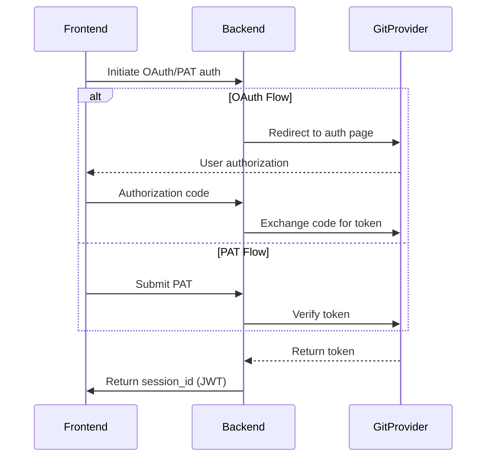

# Backend Architecture

The Git Recap backend is built using FastAPI and provides RESTful API endpoints along with WebSocket support for real-time updates.

## Table of Contents
- [API Structure](#api-structure)
- [Core Services](#core-services)
- [Authentication Flow](#authentication-flow)
- [Environment Variables](#environment-variables)
- [Deployment](#deployment)
- [Rate Limiting](#rate-limiting)
- [Error Handling](#error-handling)

## API Structure

### Authentication
- **GitHub OAuth**: `/external-signup` endpoint handles OAuth callback
- **PAT Authentication**: `/pat` endpoint for Personal Access Token auth
- **Session Management**: JWT-based session tokens with 5-minute expiration

### Main Endpoints
| Endpoint | Method | Description |
|----------|--------|-------------|
| `/repos` | GET | Lists available repositories |
| `/actions` | GET | Retrieves Git activity data |
| `/ws/{session_id}` | WebSocket | Real-time LLM response streaming |

### Middleware
- **CORS**: Configured for frontend integration
- **Rate Limiting**: Global request throttling
- **Request Validation**: Pydantic models for input validation

## Core Services

### `llm_service.py`
- Manages LLM sessions and configurations
- Handles message trimming and token counting
- Provides simulated responses for testing
- Key methods:
  - `generate_response()`: Processes user queries
  - `trim_messages()`: Ensures token limits
  - `count_tokens()`: Estimates token usage

### `fetcher_service.py`
- Stores and manages Git provider fetchers
- Handles session expiration (5-minute TTL)
- Provides access to repository data
- Supported providers:
  - GitHub (via PyGithub)
  - GitLab (via python-gitlab)
  - Azure DevOps (via azure-devops)

## Authentication Flow



## Environment Variables

```bash
# Required
VITE_FRONTEND_HOST= # Frontend origin for CORS
VITE_GITHUB_CLIENT_ID= # GitHub OAuth app ID
VITE_GITHUB_CLIENT_SECRET= # GitHub OAuth secret
SECRET_KEY= # JWT signing key

# Optional
RATE_LIMIT=30 # Requests per window (default: 30)
WINDOW_SECONDS=3 # Rate limit window (default: 3s)
SESSION_TTL=300 # Session timeout in seconds (default: 300)
DEBUG=false # Enable debug mode
```

## Deployment

### Docker
```bash
docker-compose up --build
```

### Manual
```bash
uvicorn main:app --host 0.0.0.0 --port 8000
```

### Production Recommendations
- Use Gunicorn with Uvicorn workers
- Configure HTTPS via reverse proxy (Nginx)
- Set up proper secret management
- Monitor with Prometheus/Grafana

## Rate Limiting
- Global rate limit applied to all endpoints
- Configurable via environment variables
- Returns `429 Too Many Requests` with headers:
  - `X-RateLimit-Limit`: Total allowed requests
  - `X-RateLimit-Remaining`: Remaining requests
  - `X-RateLimit-Reset`: Window reset time

## Error Handling
Standard error responses include:
```json
{
  "detail": "Error message",
  "status": "error",
  "code": 400
}
```

Common error codes:
- `400`: Bad request
- `401`: Unauthorized
- `403`: Forbidden
- `404`: Not found
- `429`: Rate limited
- `500`: Server error