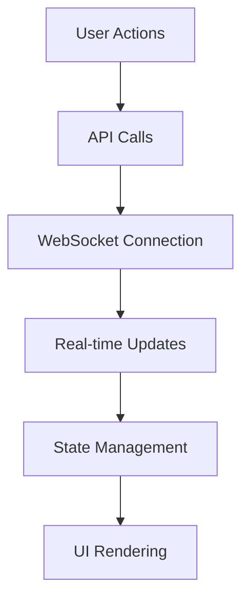

# Frontend Architecture

The Git Recap frontend is a modern React application built with Vite and TypeScript, featuring a pixel-retro UI style for a distinctive developer experience.

## Project Structure

```
app/git-recap/
├── src/
│   ├── App.tsx        # Main application component
│   ├── main.tsx       # Application entry point
│   ├── components/    # Reusable UI components
│   ├── hooks/         # Custom React hooks
│   ├── services/      # API/WebSocket services
│   ├── types/         # TypeScript type definitions
│   └── utils/         # Utility functions
```

## Core Components

### Authentication Flow
- **OAuth Integration**: Secure GitHub login via OAuth
- **PAT Fallback**: Personal Access Token input for restricted environments
- **Session Management**: JWT token handling with refresh logic

### Main Application (`App.tsx`)
- Handles application state management
- Coordinates between:
  - Authentication provider
  - Date range selector
  - Repository/author filters
  - WebSocket service
  - Summary display components

### UI Components
Built with `pixel-retroui` library:
- **Interactive Elements**:
  - Retro-styled buttons and inputs
  - Toggle switches for filters
  - Progress indicators
- **Data Display**:
  - Expandable accordions for detailed views
  - Card-based layout for summaries
  - Timeline visualization for activity

## Data Flow Architecture



### Key Features
1. **Real-time Updates**:
   - WebSocket connection to backend
   - Live progress indicators during LLM processing
   - Instant summary updates

2. **Customizable Summaries**:
   - Adjustable length (5/10/15 key points)
   - Focus filters (commits/PRs/issues)
   - Time period selection (day/week/custom)

3. **Responsive Design**:
   - Mobile-friendly layout
   - Adaptive component sizing
   - Dark/light mode support

## Development Setup

### Prerequisites
- Node.js 16+
- npm/yarn

### Installation
```bash
cd app/git-recap
npm install
```

### Running Locally
```bash
npm run dev
```

### Building for Production
```bash
npm run build
```

## Configuration

Environment variables (`.env`):
```ini
VITE_API_BASE_URL=http://localhost:8000
VITE_WS_URL=ws://localhost:8000/ws
VITE_GITHUB_CLIENT_ID=your_client_id
```

## Testing
- Jest + React Testing Library
- Component snapshot tests
- Interaction tests for critical flows

```bash
npm test
```

## Style Guide
- TypeScript with strict typing
- Functional components with hooks
- CSS Modules for styling
- Consistent pixel-retro aesthetic