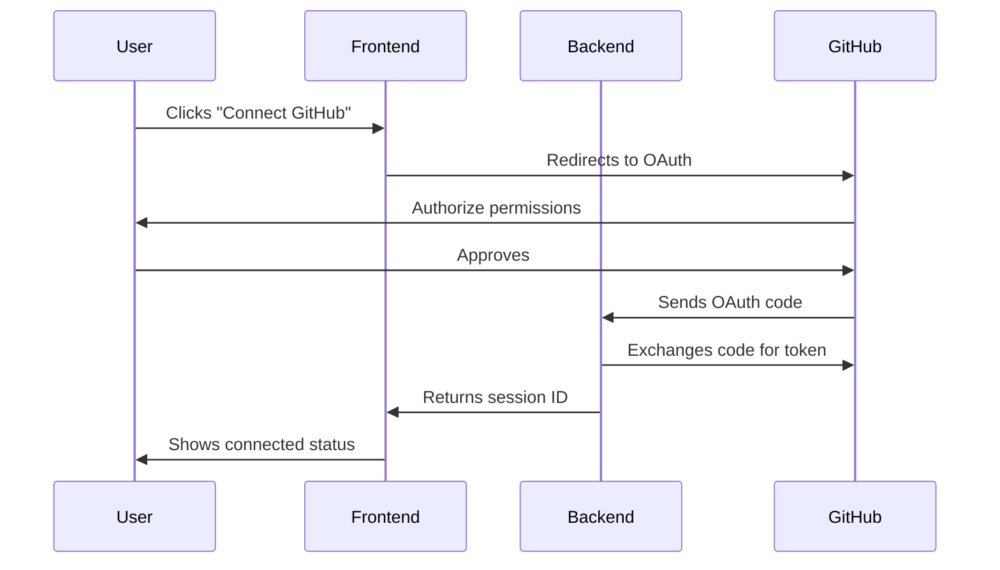

# GitHub App Integration

## Overview
Git Recap integrates with GitHub through both GitHub Apps and Personal Access Tokens (PATs). The GitHub App provides a more secure and scalable authentication method with fine-grained permissions.

## Installation

### From GitHub Marketplace
1. Navigate to [GitHub Marketplace](https://github.com/marketplace)
2. Search for "Git Recap"
3. Click "Install" and select:
   - **All repositories** (recommended) or specific repositories
   - Target organization or user account

### Manual Setup (Development)
1. Create a new GitHub App in your organization:
   ```bash
   https://github.com/organizations/YOUR_ORG/settings/apps/new
   ```
2. Configure with these settings:
   - Homepage URL: `https://your-git-recap-instance.com`
   - Callback URL: `https://your-git-recap-instance.com/auth/callback`
   - Webhook URL: `https://your-git-recap-instance.com/webhooks/github`

## Required Permissions

```yaml
permissions:
  metadata: read
  contents: read
  pull_requests: read
  issues: read
  commit_statuses: read
```

## Authentication Flow



## Webhook Configuration
For real-time updates, configure these webhook events:
- `pull_request` (opened, closed, reopened)
- `issues` (opened, closed, reopened)
- `push`

Example payload URL:
```
https://your-api-domain.com/webhooks/github
```

## Personal Access Token (PAT) Fallback
When GitHub App isn't available, you can use a PAT with equivalent permissions:
1. Generate PAT with:
   - `repo` scope (full access to private repos)
   - `read:org` scope (for organization visibility)
2. Configure via API:
   ```bash
   POST /api/v1/auth/pat
   {
     "token": "ghp_your_token_here",
     "provider": "github"
   }
   ```

## Troubleshooting

### Common Issues

| Issue | Solution |
|-------|----------|
| Missing repositories | Ensure App is installed on target org |
| Permission errors | Reinstall App with correct permissions |
| Rate limiting | Check API usage in GitHub settings |
| Webhook failures | Verify endpoint URL and secret |

### Debugging
1. Check GitHub App logs:
   ```bash
   https://github.com/organizations/YOUR_ORG/settings/apps/YOUR_APP/advanced
   ```
2. Verify webhook deliveries
3. Check backend logs for authentication errors

## Best Practices
- Use different GitHub Apps for production/staging
- Rotate PATs every 90 days
- Monitor rate limits (5000 requests/hour for Apps)
- Restrict repository access to only what's needed