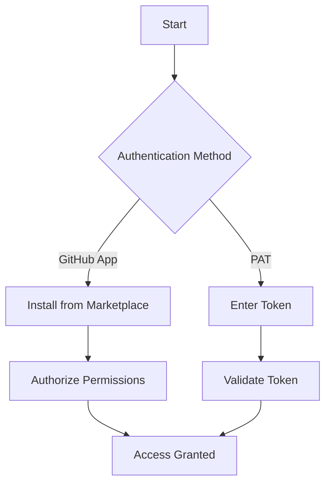

# GitHub App Usage Guide

## Overview
Git Recap integrates with GitHub through both GitHub App and Personal Access Token (PAT) authentication methods. This guide covers installation, configuration, and usage of the GitHub integration.

## Installation

### GitHub App Installation (Recommended)
1. Visit the [GitHub Marketplace](https://github.com/marketplace) and search for "Git Recap"
2. Click "Install" and follow the authorization flow
3. Select repositories you want the app to access:
   - All repositories
   - Only select repositories
4. Confirm permissions:
   - Read access to metadata
   - Read access to commits and pull requests
   - Read access to issues

### Personal Access Token (Alternative)
1. Generate a PAT with these scopes:
   - `repo` (full access to private repositories)
   - `read:org` (organization access)
   - `read:user` (user information)
2. Add the PAT in Git Recap's settings

## Authentication Flow

## Key Features

### Repository Access
- View all repositories where you have:
  - Owner permissions
  - Collaborator access
  - Organization membership
- Filter repositories by:
  - Organization
  - Visibility (public/private)
  - Last activity date

### Activity Tracking
- **Commits**:
  - Authored commits
  - Commits in pull requests
  - Code review comments
- **Pull Requests**:
  - Created PRs
  - Reviewed PRs
  - Commented PRs
- **Issues**:
  - Created issues
  - Assigned issues
  - Mentioned issues

## Workflows

### Daily Recap
1. Select date range (default: today)
2. Choose repositories (default: all accessible)
3. Filter by activity type:
   - Commits only
   - PRs only
   - Issues only
   - All activity
4. Generate summary with:
   - Activity count
   - Time spent estimates
   - Key highlights

### Weekly Review
1. Set 7-day date range (Monday-Sunday)
2. Filter by:
   - Repository
   - Author
   - Activity type
3. Generate comprehensive report with:
   - Weekly totals
   - Trend analysis
   - Top repositories
   - Time distribution

## Permissions Reference

| Permission | GitHub App | PAT Required |
|------------|------------|--------------|
| Public repos | ✅ | ❌ |
| Private repos | ✅ | `repo` scope |
| Organization repos | ✅ | `read:org` scope |
| User profile | ✅ | `read:user` scope |

## Troubleshooting

### Common Issues

**"Repository not found"**
- Solution: Install the GitHub App from Marketplace
- Verify app has access to the repository

**"No actions found"**
- Check your date range includes recent activity
- Verify repository/author filters
- Ensure you have proper permissions

**"Authentication failed"**
- Reauthorize the GitHub App
- Generate a new PAT if using token auth
- Check token scopes are sufficient

## Advanced Configuration

### Webhook Setup (Optional)
For real-time updates, configure webhooks:
1. Go to repository Settings > Webhooks
2. Add new webhook:
   - Payload URL: `https://your-gitrecap-instance.com/webhooks/github`
   - Content type: `application/json`
   - Events: Select individual events or "Send me everything"

### Rate Limit Management
Git Recap automatically handles GitHub's rate limits by:
- Implementing exponential backoff
- Caching responses
- Using conditional requests (ETags)