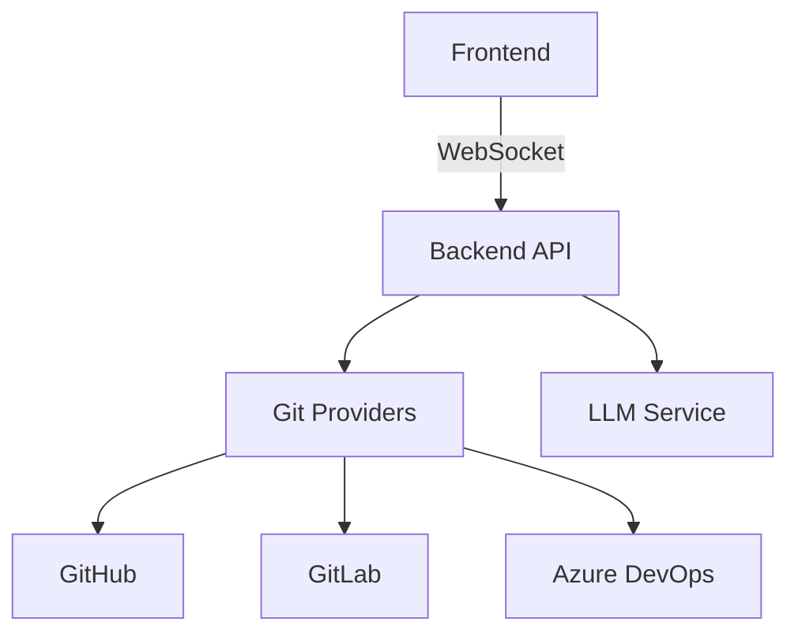

# Git Recap Overview

Git Recap is a developer productivity tool that aggregates and summarizes your Git activity across multiple platforms into concise, actionable insights. Designed for developers who work across multiple repositories and platforms, it provides a unified view of your coding activity.

## Key Features

- **Multi-Platform Support**: Works with GitHub, GitLab, and Azure DevOps
- **Comprehensive Activity Tracking**: Captures commits, pull requests, and issues
- **Smart Summarization**: Uses LLMs to generate concise recaps of your work
- **Flexible Filtering**: Filter by date range, repositories, and authors
- **Real-time Updates**: WebSocket integration for live progress updates
- **Retro UI**: Pixel-art styled interface for a fun user experience
- **Multiple Authentication Options**: GitHub OAuth or Personal Access Tokens

## Architecture Overview

Git Recap follows a modular architecture with clear separation between components:

### Backend Service (FastAPI)
- **REST API**: Handles authentication and data fetching
- **WebSocket Endpoint**: Provides real-time LLM responses
- **Provider Fetchers**: GitHub, GitLab, and Azure DevOps implementations
- **Session Management**: Maintains user sessions and LLM instances
- **Security**: CORS, rate limiting, and session expiration

### Frontend (React + TypeScript)
- **Pixel-Retro UI**: Custom-styled components for visual appeal
- **Authentication**: GitHub OAuth and PAT integration
- **Interactive Controls**: Date range picker, repository selector
- **Real-time Updates**: WebSocket connection for live summaries
- **Responsive Design**: Works across desktop and mobile

### Core Python Package
- **Provider Abstraction**: Unified interface for Git platforms
- **Data Processing**: Normalizes activity data from different sources
- **LLM Integration**: Formats data for effective summarization
- **Utilities**: Common functions for text processing and output

## Use Cases

1. **Daily Standups**: Quickly recap yesterday's work
2. **Weekly Reviews**: Summarize a week's worth of activity
3. **Onboarding**: Get up to speed on a new codebase
4. **Performance Tracking**: Visualize your contributions over time

## Supported Platforms

| Platform       | Features Supported               |
|----------------|----------------------------------|
| GitHub         | Commits, PRs, Issues, Reviews   |
| GitLab         | Commits, MRs, Issues            |
| Azure DevOps   | Commits, PRs, Work Items        |

For detailed setup instructions, see our [Installation Guide](installation.md). To start using with your GitHub account, check the [GitHub App Usage](github-app.md) documentation.