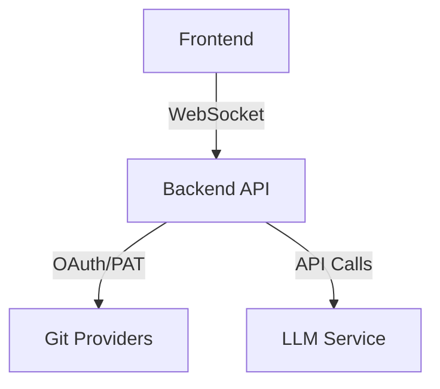

# Git Recap Overview

Git Recap is a developer productivity tool that aggregates and summarizes your Git activity across multiple platforms into a concise, actionable format. Designed for developers and teams, it helps track work across repositories and provides intelligent summaries of your contributions.

## Key Features

- **Multi-Platform Support**: Unified interface for GitHub, GitLab, and Azure DevOps
- **Comprehensive Activity Tracking**: Captures commits, PRs, issues, and reviews in one dashboard
- **Smart Summarization**: Uses LLMs to generate concise recaps of your work
- **Real-time Updates**: WebSocket integration for live progress updates
- **Flexible Filtering**: Filter by date range, repositories, authors, and activity types
- **Retro UI**: Pixel-art inspired interface with a nostalgic gaming aesthetic

## Architecture Overview

Git Recap consists of three main components working together:

### 1. Backend API (FastAPI)
- **Authentication**: Secure OAuth and PAT-based authentication flows
- **Provider Integrations**: Unified interface for GitHub, GitLab, Azure DevOps
- **LLM Service**: AI-powered summarization and analysis
- **WebSocket Server**: Real-time communication channel
- **Rate Limiting**: Protection against API abuse

### 2. Frontend (React + Vite)
- **Authentication UI**: OAuth flow and PAT management
- **Repository Selector**: Multi-repo filtering interface
- **Activity Dashboard**: Timeline view of Git events
- **LLM Output**: Configurable summary display
- **Retro Theme**: Custom pixel-art UI components

### 3. Core Python Package
- **Provider Abstraction**: Standardized interface for Git platforms
- **Data Processing**: Normalization and formatting of Git events
- **LLM Integration**: Prompt engineering and response handling
- **Utilities**: Date handling, text formatting, and logging

## Use Cases

- **Daily Standups**: Quickly recap yesterday's work
- **Weekly Reports**: Generate comprehensive activity summaries  
- **Onboarding**: Understand new team members' contributions
- **Code Reviews**: Contextualize changes with related activity
- **Personal Tracking**: Maintain a searchable history of your work

## Supported Platforms

| Provider       | Authentication | Features Supported |
|----------------|----------------|--------------------|
| GitHub         | OAuth, PAT     | Commits, PRs, Issues, Reviews |
| GitLab         | PAT            | Commits, MRs, Issues |
| Azure DevOps   | PAT            | Commits, PRs, Work Items |

## Getting Started

1. [Install the application](installation.md)
2. [Configure authentication](github-app.md)  
3. [Explore your Git activity](frontend.md)

For detailed technical information, see our [backend](backend.md) and [frontend](frontend.md) architecture documentation.